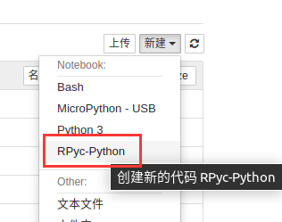

# &emsp;&emsp;&emsp;&emsp;&emsp;&emsp;&emsp; 💮 RPyC の iPykernel 🐹

[](./LICENSE)
[](https://badge.fury.io/py/rpyc-ikernel)

该内核设计取自以下 Python 仓库。

- [ipykernel](https://github.com/ipython/ipykernel)
- [rpyc](https://github.com/tomerfiliba-org/rpyc)

参考内核如下。

- [bash_kernel](https://github.com/takluyver/bash_kernel)
- [ubit_kernel](https://github.com/takluyver/ubit_kernel)
- [remote_ikernel](https://github.com/tdaff/remote_ikernel)
- [jupyter_micropython_kernel](https://github.com/goatchurchprime/jupyter_micropython_kernel)

## 说明：

1. 和 iPython 一样， 因为 RPycKernel 继承 IPythonKernel ，支持 Python3 语法和 Tab 补全代码。

2. 以远端（remote）代码为执行对象，服务轻量化，内存占用小。

> 在 armv7 Python3 上需要 11M，而 iPykernel 需要 39M ，对比 iPykernel 的服务更加轻量化，不需要 iopub / shell / stdio / heart 等通道。

3. 支持获取（HOOK）远端变量，如 display image 图像绘制到返回页面当中。

4. 更多信息请查看 [example](./example/view_images.ipynb) 的 ipynb 文档（效果所见即所得！）。

## 安装方法

如下示范在 Python3 安装，先安装 iPython 环境，再安装 iPykernel 内核即可。

```shell
pip3 install rpyc_ikernel
python3 -m rpyc_ikernel.install
```

有如下找不到模块常见错误，常见于 py2 和 py3 不分。

- `/usr/bin/python3: Error while finding module specification for 'rpyc-ikernel.install' (ModuleNotFoundError: No module named 'rpyc-ikernel')`
- `/usr/bin/python: No module named rpyc-ikernel`

## 配置你的硬件

首先，确定你机器的 IP 地址（ifconfig），请确保可以 ping 通，确保没有防火墙挡着。

接着，在硬件中启动 rpyc 服务，请在安装 ` pip install rpyc ` 后，创建服务代码。

- `vi rpycs.py`

```python
from rpyc.utils.server import ThreadedServer
from rpyc.core.service import SlaveService
server = ThreadedServer(SlaveService, hostname="0.0.0.0", port=18812, reuse_addr=True)
server.start()
```

最后运行在后台即可，此时你的 rpyc 服务已经起来了。

- `python3 rpycs.py &`

## 运行远端代码

输入 `jupyter notebook` 会自动打开系统默认浏览器，请选中 rpyc 的内核，新建（new）一个文件。



如果没有看到，则可以输入 `python3 -m rpyc_ikernel.install` 完成内核的安装，此时就可以看到了。

输入 `jupyter kernelspec list` 可以查看当前安装的 jupyter 内核。

```shell
Available kernels:
  bash           /home/juwan/.local/share/jupyter/kernels/bash
  micropython    /home/juwan/.local/share/jupyter/kernels/micropython
  python3        /home/juwan/.local/share/jupyter/kernels/python3
  rpyc           /home/juwan/.local/share/jupyter/kernels/rpyc
```

接着运行代码前，需要先配置 IP 地址进行连接，请运行以下代码:

```python
################ 连接你的硬件 #################
#
# 将下述代码的 IP 地址修改后运行一次即可。
#
#   【注意看下面这段配置远端设备的代码！！！！！！！！】
#
#      exec(self.connect_remote("172.20.152.133"))
#
#
#
#############################################
import platform
print(platform.uname())
```

可见返回结果如下：

```shell
uname_result(system='Linux', node='linux-lab', release='5.4.0-56-generic', version='#62-Ubuntu SMP Mon Nov 23 19:20:19 UTC 2020', machine='x86_64', processor='x86_64')
```

更多示例可以参考 [example](example) 中的文档。

> 注释中的 `# exec(print('hello world!'))` 可以执行本地 Python 代码。主要原因是在 Python 代码出现 %connect_remote 172.20.152.133 太丑了。我们可以在 micropython / ssh 内核的看到这样的调用方法，另一个原因是我不想配置一堆不同参数的内核。

## 常见问题

这与网络环境有很大关系，我们可以通过以下顺序排查问题：

### 环境问题

当发现一段简单的 Python 代码执行后没有反应，可以按以下步骤排查错误。

- 若在代码运行时，按中断按钮未能停止，请刷新代码网页，再尝试执行代码。
- 重启 jupyter note 服务，重新连接远端设备执行代码。

如果仍然不行，则可能是网络问题，继续排查。

### 网络问题

确保本机可以连接到远端机器，使用 Ping 或 socket 等工具进行连接。

- 确定本机所属网络，试图 ping 通从机 IP 地址。
- 确定远端所属网络，试图 ping 通主机 IP 地址。
- 确保上级路由器转发规则没有限制。

### 其他问题

重启就好了。

## 设计核心

我们可以注意到如下图传代码的实现。

```python
# 读取图像，配置要获取的图像缓冲变量 img_buffer
# 
# exec(self.display('img_buffer', interval=0.05))
#

from PIL import Image

import io, time

while True:
    time.sleep(0.02)
    
    img = Image.new("RGB", (320, 240), "#FF00")

    img_buffer = io.BytesIO()

    img.save(img_buffer, format='JPEG')  # show jupyter notebook
    
    img.show()                           # show remote lcd
    
```

实际上它是这样工作的，摘取 [kernel.py](./rpyc_ikernel/kernel.py) 的 display 函数部分实现。

```python
def display(self, var_name, interval=0.05): # 0.05 20 fps
    if self.remote and var_name in self.remote.namespace:
        # self.log.info('exist: ' + var_name)
```

可以得知 `# exec(self.display('img_buffer', interval=0.05))` 意图为获取 'img_buffer' 的变量，而这个变量取自于远端机器里的 Python 变量。

也就是代码中运行的 `img_buffer = io.BytesIO()` ，而这个变量会被 `img.save(img_buffer, format='JPEG')` 写入，也就是说 `self.display` 实际上就是调用 RPycKernel 函数 hook 某个 jpeg 图像，并将其显示到 notebook 的返回页面空间中，也可以是其他图像流，如 PNG BMP 之类的。

根据这个实现的启发，我们也可以 hook 远端的其他变量结果。

## uplaod pypi

```shell
python setup.py sdist build
```

```shell
# pip install twine
twine upload dist/* --verbose
```

